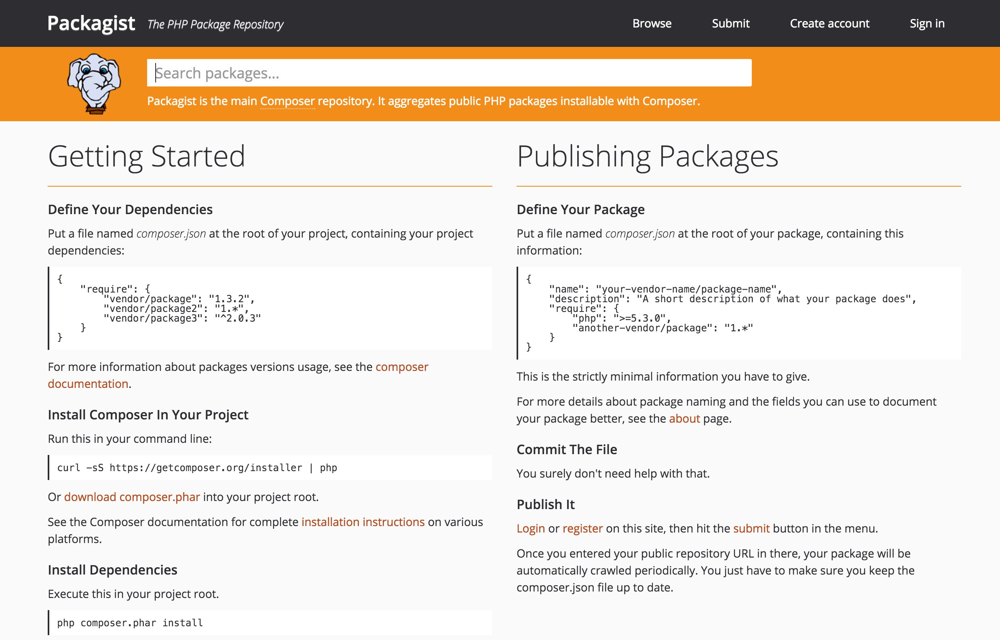
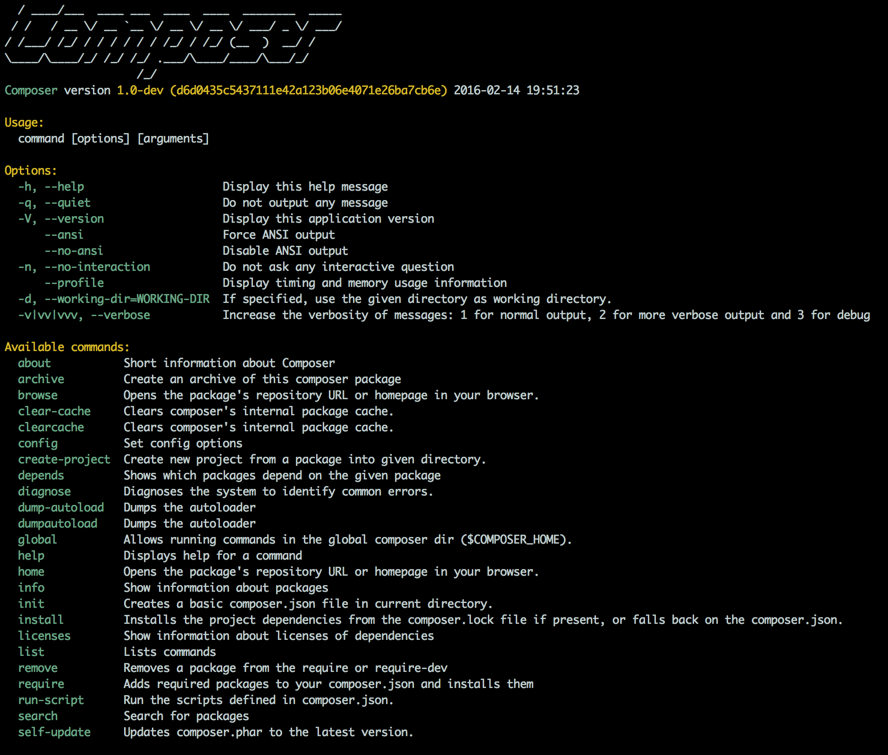
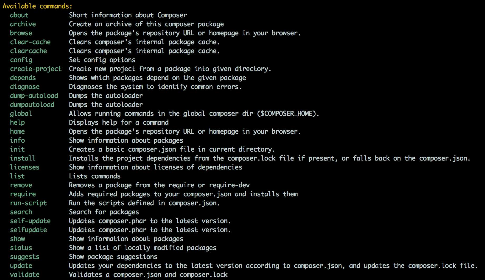
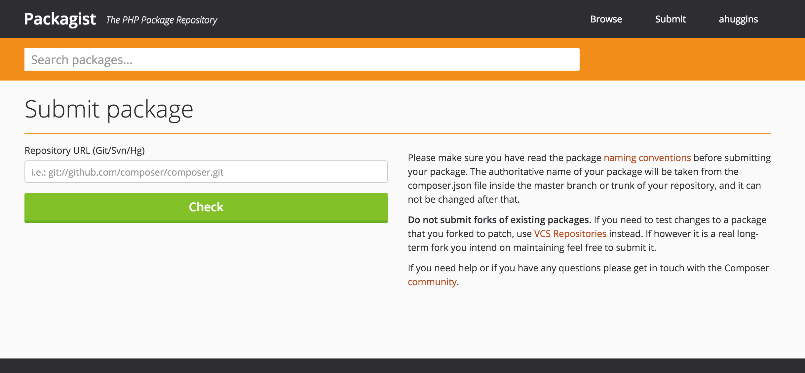
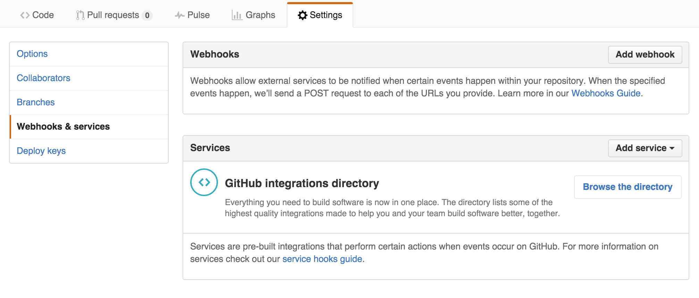
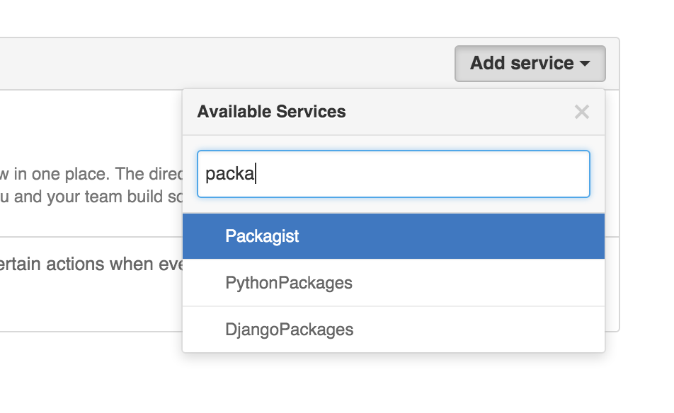

title: You should use Composer
author:
  name: Andrew Huggins
  twitter: andy_huggins
  url: http://andrewhuggins.com
theme: sudodoki/reveal-cleaver-theme
output: you-should-use-composer.html
controls: false
style: composer-style.css

--
<!--  -->
# You Should Use Composer
## A tool for modern PHP workflow
--
## What is Composer?
### A package manager for PHP
--
### Who is Composer?

Jordi Boggiano

Nils Adermann, and some help from the Community
--
### Where to get Composer?
[getcomposer.org](http://getcomposer.org)
![alt text][logo]
[logo]: homepage.png "Logo Title Text 2"
--
### Install it Globally
`$ mv composer.phar /usr/local/bin/composer`

*On windows, you're gonna have to do something else.*
--
### OK, so now what?
#### Install all the packages
[Packagist.org](http://packagist.org)

--
### What to do with it?
##### Run composer in Terminal and see what's available
`$ composer`

--
## All Commands

--
## Most Common Commands
* `$ composer create-project`
* `$ composer install`
* `$ composer update`
* `$ composer require`
* `$ composer remove`
* `$ composer dumpautoload`
* `$ composer selfupdate`
* `$ composer init`

--
## How does all this work?
### Autoload
`<?php require '/vendor/autoload.php';`
### vendor directory
--
## X Class not found
`$ composer dumpautoload`

Try first, everytime.
--
## composer.lock out of sync
Delete the file and run `$ composer install`

Note: composer.lock should be included in git repository
--
## Errors installing packages
Sometimes the order of packages seems to matter

`--no-scripts` flag prevents running any packages

`$ composer install --no-scripts`
--
## Composer is pretty slow
### Prestissimo
[https://github.com/hirak/prestissimo](https://github.com/hirak/prestissimo)

`$ composer global require hirak/prestissimo`
--
## Additionally
`--no-update`
--
## Avoid using Sudo
Permissions get borked and you may need to clear the entire Composer cache of files to fix. Usually your error is in something else.
--
## Build your own packages
`$ composer init`

[http://phppackagechecklist.com/](http://phppackagechecklist.com/)
--
## Add your package to Packagist
First, sign up for a Packagist account.

--
## Then On Github:

--

Allow a few minutes for it to show up on Packagist
--
### With great power, comes great responsibility

--
## Frameworks that use Composer
* Laravel
* Symfony
* FuelPHP
* Codeigniter
* CakePHP
* Zend

Who doesn't use Composer?
--
## Presentation made with Cleaver
[https://github.com/jdan/cleaver](https://github.com/jdan/cleaver)

Markdown slides, easy, classy

